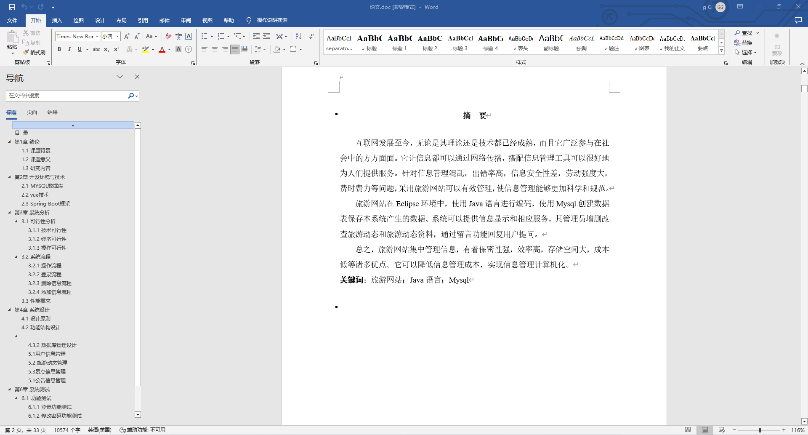
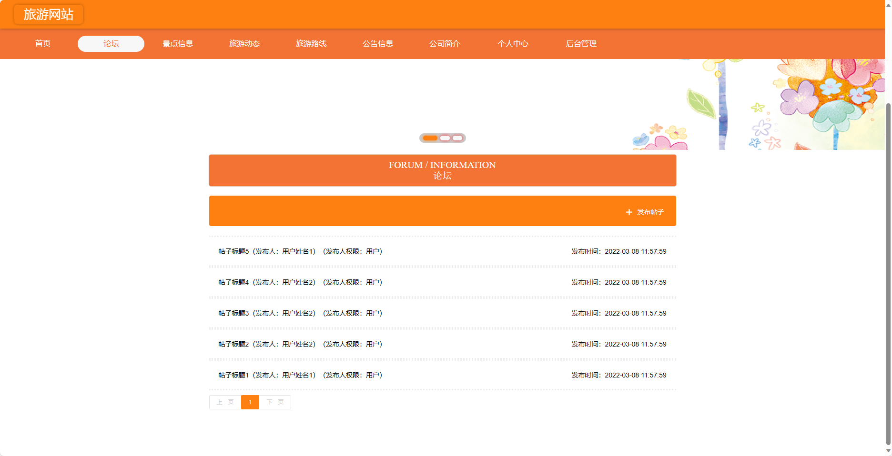
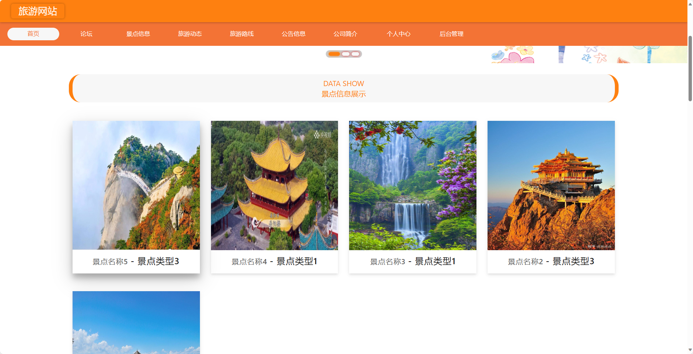
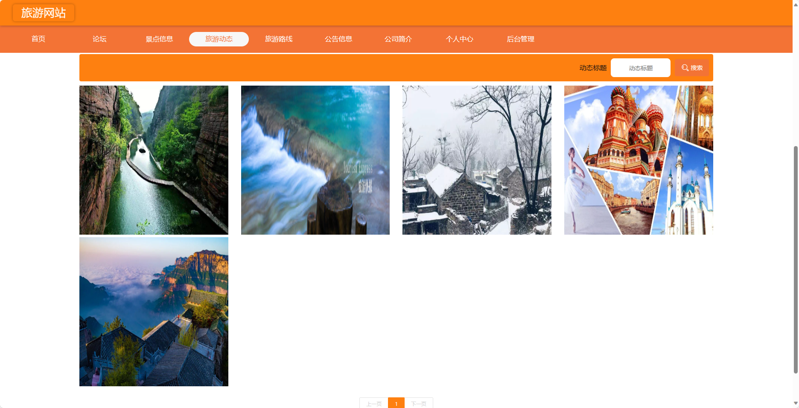
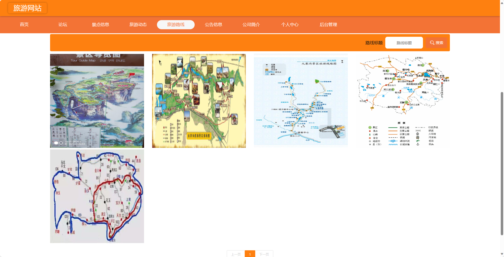
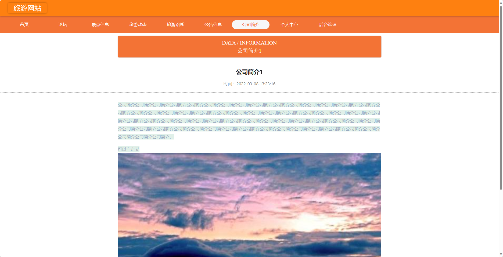
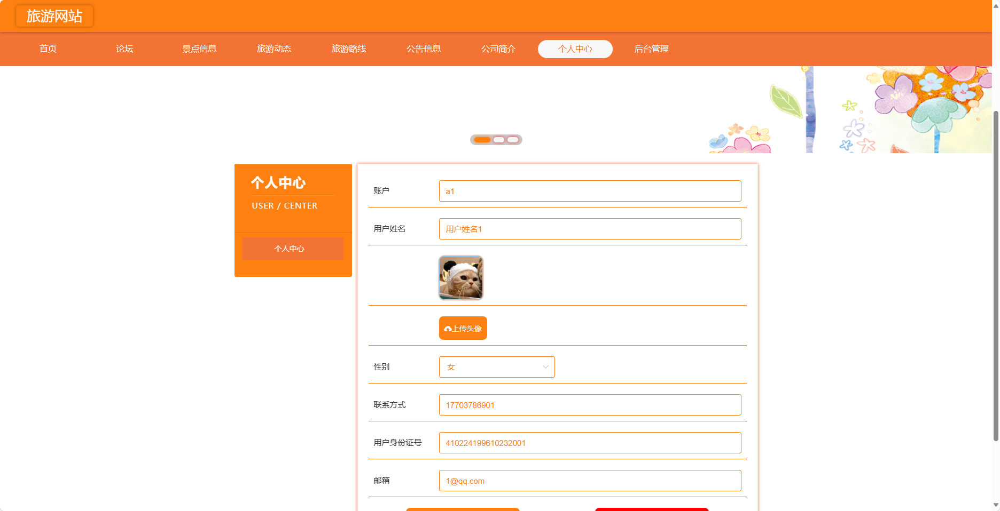
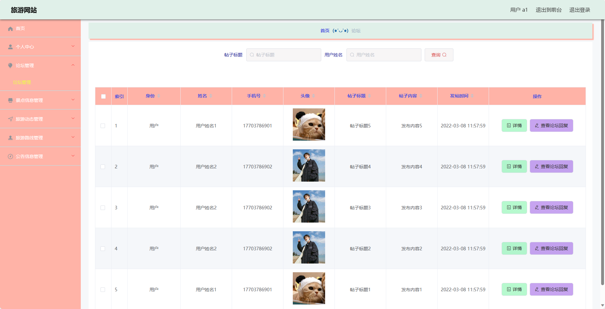

## 基于SpringBoot的旅游网站(程序+报告)

###  获取sql数据库文件: 从戎源码网 (https://armycodes.com/) QQ: 386869957 QQ群: 377586148
###  所有系统地址: (https://github.com/YuLin-Coder/AllProjectCatalog) 
###  所有项目以及源代码本人均调试运行无问题 可支持远程安装部署调试、定制修改、代码讲解

## 项目介绍
基于SpringBoot的旅游网站，系统包含两种角色：管理员、用户,系统分为前台和后台两大模块，主要功能如下。

### 【管理员】:
- 个人中心：管理个人信息。
- 管理员管理：管理其他管理员账号的信息。
- 基础数据管理：管理系统中的基础数据，例如城市信息、旅游类型等。
- 论坛管理：管理论坛帖子和评论，包括审核和删除等操作。
- 景点信息管理：管理旅游景点信息，包括添加、编辑、删除景点等操作。
- 旅游动态管理：发布和管理最新的旅游动态信息。
- 旅游路线管理：管理旅游路线信息，包括添加、编辑、删除路线等操作。
- 公告信息管理：发布和管理最新的旅游网站公告信息。
- 公司简介管理：编辑和更新旅游网站的公司背景和发展历程。
- 用户管理：管理用户账号信息，包括添加、编辑、删除用户等操作。
轮播图信息：管理系统的轮播图信息，包括添加、编辑、删除等操作。

### 【用户】:
- 个人中心：管理个人信息，包括订单记录、个人设置等。
- 论坛管理：参与旅游相关的论坛交流，发表帖子和评论。
- 景点信息管理：查看旅游景点信息，包括景点介绍、图片等。
- 旅游动态管理：查看最新的旅游动态信息。
- 旅游路线管理：查看旅游路线信息，包括路线介绍、行程安排等。
- 公告信息管理：查看最新的旅游网站公告信息。

### 【前台】:
- 首页：展示旅游网站的相关内容。
- 论坛：用户可以在论坛中进行旅游交流和分享。
- 景点信息：浏览和搜索旅游景点信息。
- 旅游动态：查看最新的旅游动态信息。
- 旅游路线：浏览和搜索旅游路线信息。
- 公告信息：查看最新的旅游网站公告信息。
- 公司简介：了解旅游网站的公司背景和发展历程。
- 个人中心：管理个人信息，包括订单记录、个人设置等。

## 项目技术
- 编程语言：Java
- 数据库：MySQL
- 项目管理工具：Maven
- 前端技术：HTML、CSS、JavaScript、Jquery、Vue
- 后端技术：Spring、SpringMVC、MyBatis

## 运行环境
- JDK版本：JDK1.8及以上
- 开发工具：IDEA、Ecplise、Myecplise都可以
- 数据库: MySQL5.7及以上
- Maven：maven3.0及以上
- Node：14.14.0及以上

## 运行截图

